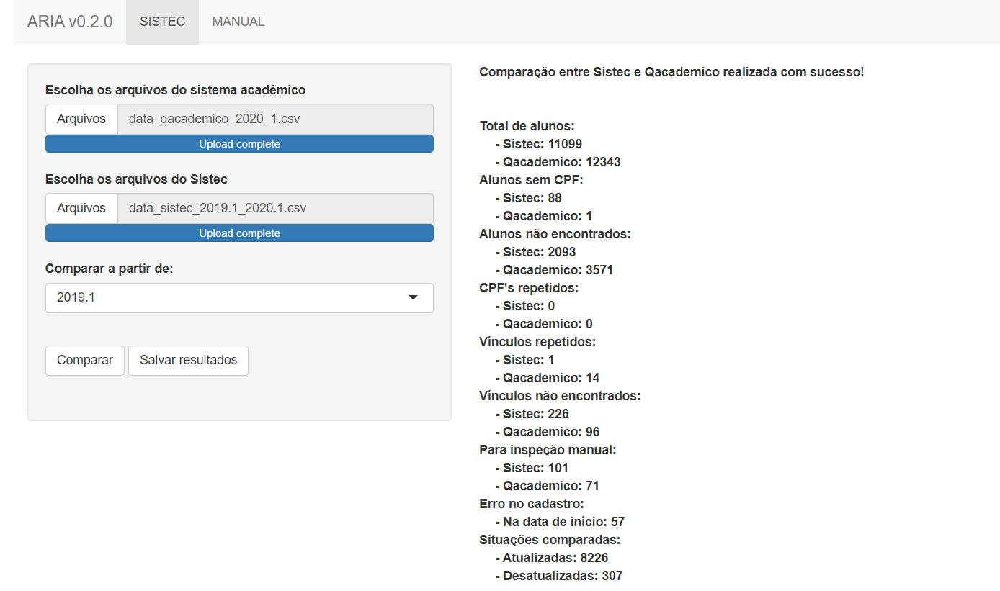

  [](https://travis-ci.org/r-ifpe/sistec)
  [](https://cran.r-project.org/package=sistec)
  [](https://circleci.com/gh/r-ifpe/sistec)

```{r setup, include=FALSE}
knitr::opts_chunk$set(eval = FALSE)
knitr::opts_chunk$set(warning = FALSE)
```

O [Sistec](https://sistec.mec.gov.br/) é o sistema brasileiro para registro e validação de diplomas dos cursos em nível técnico e superior. O pacote `sistec` disponibiliza ferramentas para auxiliar os institutos brasileiros a realizar a atualização dos registros estudantis, bem como analisar os dados sobre a situação do aluno, evasão e retenção. 

## Instalação

Você pode instalar o pacote `sistec` do [CRAN](https://CRAN.r-project.org) dessa forma:

```{r, eval=FALSE}
install.packages("sistec")
```

Para utilizar as versões mais novas, execute o comando abaixo e reinicie sua sessão do R:

```{r, eval=FALSE}
install.packages("devtools")
devtools::install_github("r-ifpe/sistec")
```

Carregue o pacote:
```{r eval=FALSE}
library(sistec)
```

## Dados do Sistec

Você pode baixar os registros de estudantes do Sistec usando sua própria conta do Sistec. O pacote lê os arquivos tanto da  [setec](http://portal.mec.gov.br/setec-secretaria-de-educacao-profissional-e-tecnologica) quanto da [web](https://sistec.mec.gov.br/). Certifique-se que as seguintes colunas se encontram na sua base de dados: 

 - Pela setec: "Nome Aluno", "Numero Cpf", "Co Ciclo Matricula", "Situacao Matricula", "No Curso",
 "Dt Data Inicio" e "Unidade Ensino".
  
 - Pela web: "NO_ALUNO", "NU_CPF", "CO_CICLO_MATRICULA", "NO_STATUS_MATRICULA", "NO_CICLO_MATRICULA", "DT_DATA_INICIO" e "CO_UNIDADE_ENSINO".

Dica: Para obter todos os estudantes da sua instituição/campus, busque por nome do estudante e use " ".

## Dados do Qacademico

Para baixar os dados do estudante, vá na sua conta do Qacademico e siga:

 - "Relatório de Alunos" --> "Listagem de Alunos" (escolha ano e período)
 - Clique em "visualizar" 
 - Use o atalho f10 e salve em formato .csv
 - Renomeie os arquivos incluindo ano e período, por exemplo example2020_1.csv. Caso só precise de um arquivo, não precisa renomear.

Certifique-se que seus dados possuem as colunas: "Matricula", "Nome", "Situacao Matricula", "Curso", "Cpf", "Instituicao", "Per. Letivo Inicial" e "Cota".

## Dados do Sigaa

Os dados do Sigaa podem ser parciais ou completos. É possível executar as comparações utilizando essas duas bases, contudo os dados parciais não apresentam informação de Campus e Cota.

Para baixar os dados parciais do Sigaa, vá na sua conta siga esses passos:

 - Acesse o painel de "Consultas" dentro do modulo do Sigaa
 - Gere o relatório "Consulta geral discentes"
 - Selecione o *check box* "Trazer informações em forma de relatório" e "Gerar csv"
 - Selecione o "Campus" e outros filtros que você deseja
 - Clique em "Buscar" e baixe o arquivo. 

Para os dados completos, você precisa baixar os arquivos direto da base do Sigaa. Certifique-se que seus dados possuem as colunas: "Matricula", "Nome", "Situacao Matricula", 
"Curso", "Cpf", "Instituicao", "ano_ingresso", "semestre_ingresso" and "Cota". 

## Lendo os arquivos

Para ler os arquivos, carregue o pacote `sistec` e passe, como parâmetro, o caminho da pasta onde estão os arquivos para a função `read_sistec()` e `read_rfept()`. (**NOTA**: Esses arquivos foram gerados aleatoriamente e não representam a realidade. Apenas para propósitos didáticos).

```{r eval=FALSE}
sistec <- read_sistec(system.file("extdata/examples/sistec", package = "sistec"))
qacademico <- read_rfept(system.file("extdata/examples/qacademico", package = "sistec"))
```

## Comparação

Compare a situação dos estudantes usando `compare_sistec()`:

```{r eval=FALSE}
comparison <- compare_sistec(sistec, qacademico)
```

## Salve os resultados

Você pode salvar as comparações em formato xlsx use `write_output()`:

```{r eval=FALSE}
write_output(output_path = "your_folder",
             output_folder_name = "the_name_you_want",
             comparison = comparison)
```

## ARIA

ARIA é a interface web criada para facilitar o uso do pacote `sistec`. É possível utilizar todas as funções acima apenas clicando em alguns botões. O ARIA está disponível nas versões [desktop](https://www.dropbox.com/sh/2bv2h49i8qfbzs9/AAA7MBfaZepyLMc5saDAEEo1a?dl=0), [online](https://aria.ifpe.edu.br) ou execute `aria()` na sessão do R. 


