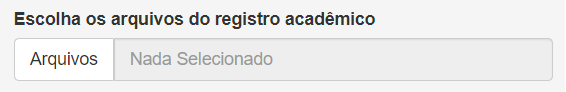
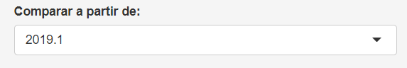
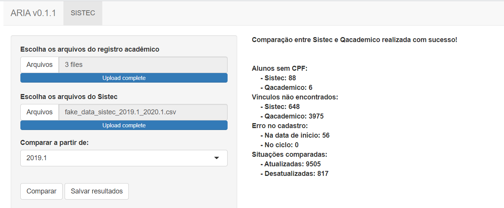

\renewcommand{\figurename}{Figura}

```{r setup, include=FALSE}
knitr::opts_chunk$set(eval = FALSE)
knitr::opts_chunk$set(warning = FALSE)
```

O ARIA é um aplicativo web criado para auxilar os servidores responsáveis por atualizar e casdastrar os alunos do registro acadêmico para o Sistec. Neste manual será descrito seu uso e como interpretar as saídas.

## Instalação

O ARIA está disponibilizado em forma de aplicativo desktop ou pode ser usado diretamente via console do R. A versão desktop pode ser instalada dando um duplo clique no executável que veio junto com este manual. 

O ARIA é um software desenvolvido em R e pode ser executado diretamente pelo console. Você pode instalar a versão estável utilizando o comando `install.packages("sistec")` ou versão mais atual em desenvolvimento utilizando o comando `devtools::install_github("r-ifpe/sistec")`. Para executar o ARIA digite o comando `sistec::aria()`.

## Entradas

Nesta versão, o ARIA só apresenta uma tela. Esta é responsável por inserir os dados de regsitro academico e Sistec.  

### Arquivos do registro acadêmico

O primeiro botão do aplicativo pede para inserir os dados do registro acadêmico. As variáveis necessárias para execução do ARIA são: Matrícula, Nome, Situação de Matrícula, Curso, Cpf, Campus, Período de entrada e Cota. Esses arquivos precisam estar em CSV.



Na sua aplicação do Qacademico, você pode obter esses dados entrando em:

- “Relatorio de Alunos” –> “Listagem de Alunos” (escolha o ano e período),
- Clique em “visualizar”,
- Use o atalho f10 e salve o arquivo em formato csv (não precisa especificar o delimitador),
- Renomeie os arquivos incluindo o ano e periodo (examplo2020_1.csv),

Certifique-se que as seguintes variáveis encontram-se no seu arquivo: “Matricula”, “Nome”, “Situacao Matricula”, “Curso”, “Cpf”, “Instituicao”, “Per. Letivo Inicial”  “Cota”.

Como os arquivos foram renomeado com ano e período, é possível baixar varios arquivos de anos diferentes e por na mesma pasta. O ARIA irá analisá-los e pegar o status mais atual do aluno.

### Arquivos do Sistec

O segundo botão do ARIA serve para inserir a lista de alunos oriundos de arquivos do Sistec. O ARIA lê arquivos em csv que podem ser extraídos da versão web do Sistec ou direntamente da Setec. 


Caso a lista de alunos tenha sido baixada do site do Sistec certifique-se de que essas variáveis estão no arquivo: NO_ALUNO, NU_CPF, CO_CICLO_MATRICULA, NO_STATUS_MATRICULA, NO_CICLO_MATRICULA, DT_DATA_INICIO e CO_UNIDADE_ENSINO. É bem provável que quando você baixe a lista venham dois arquivos: um com CPF e um sem CPF. Não se preocupe, pode pôr os dois na mesma pasta que o ARIA irá ler ambos e integrar. Uma dica, para pegar a lista com todos os alunos faça a busca por nome e procure por " ". 

Caso você tenha acesso direto aos dados da Setec, certifique-se que o seu arquivo contêm as seguintes variáveis: Nome Aluno, Numero Cpf, Co Ciclo Matricula, Situacao Matricula, No Curso, Dt Data Inicio e  "Unidade Ensino".

### Data de início da comparação

Tantos os arquivos do registro acadêmico quanto do Sistec pode ser extraídos a partir de um ano período específico. Este ultimo botão de entrada foi incluído para garantir que, mesmo que existam alunos abaixo da data especificada, estes não serão considerados no momento da comparação entre os status.



## Botões de Ação

Depois de inserir os arquivos de registro acadêmico, Sistec e escolher a data de início de execução, está na hora de realizar as comparações de status dos alunos fazer o download dos resultados.

### Comparar e Salvar resultados

Depois que todos os dados de entrada inseridos, o ARIA executará as comparações clicando no botão "comparar". Nesta tela serão mostradas, de maneira resumida, as análise feitas pelo ARIA, são estas: 

- Alunos sem CPF: Alunos que possuem o campo CPF em branco;
- Vínculos não encontrados: Alunos cujo o CPF foram encontrados em apenas uma das bases, ou seja, não foi possível encontrar o vínculo entre o registro acadêmico e o Sistec. No exemplo acima, por exemplo, 648 alunos que estão na base do Sistec não estão na base do Qcademico, precisam ser inseridos;
- Erro no cadastro: Aqui os alunos foram encontrados e vinculados corretamente, porém existe algum tipo de erro no casdastro. O erro na data de início significa que a data de entrada do aluno na instituição não corresponde com a data do início do ciclo no Sistec. O erro no ciclo ocorre quando toda uma turma está vinculada corretamente e um ou mais alunos dessa mesma entrada não apresenta o mesmo código de ciclo.
- Situações comparadas: Aqui são mostradas a quantidade de alunos que foram corretamente identificados nas duas bases. As atualizadas correspondem aos alunos que estão com a situação de matricula no registro acadêmico identica ao Sistec, ou seja, não há necessidade de modificações. As desatualizadas correspondem a quantidade de alunos que identificados corretamente mas possuem apenas o status de matricula desatualizada. 




Depois que as comparações foram executadas basta clicar no botão "Salvar resultados". Será criada uma pastas chamada ARIA e você pode escolher onde quer salvar.  

## Saídas

Na pasta de saída do ARIA encontram se cinco subpastas: Cadastrar Alunos, Cursos Relacionados, Retificar no Qacademico, Retificar no Sistec, Tabelas Utilizadas,

### Cadastrar Alunos

Na pasta "Cadastrar Alunos" encontram-se os alunos que estão no registro acadêmico, mas não estão no Sistec. Para cadastrar estes alunos, a maneria mais simples é realizar o cadastro em lote, com essa opção o usuário só precisa selecionar o ciclo (ou criar um caso não exista), selecionar se os alunos inseridos são do tipo cotista ou não e depois escrever os CPF's seguido s de ponto e virgula. O ARIA já entrega tudo pronto, os arquivos da pasta "Cadastrar Alunos" contêm os arquivos separados por campus, curso e entrada. O CPF's já vêm separados por ponto e virgula e separado por tipo de cota. É só copiar e colar.

### Cursos Relacionados

Esta pasta contêm um arquivo em xlsx com a relação entre ciclo, curso no registro acadêmico, curso no Sistec, ano de entrada e Campus. 

### Retificar no Qacademico

Estes arquivos contêm todas as informações, em relação ao registro acadêmico, encontradas pelo ARIA e já vêm separados por campus e curso. Cada planilha contida se trada de um problema especifico neste curso, seja: aluno sem CPF, inserir alunos no Sistec, alterar a data de entrada, alterar o ciclo ou retificar a situação da matrícula. 
A última planilha será sempre a de situações atualizadas, onde costam todos os alunos daquele curso que cadastrados igualmente no Sistec. Como as planilhas com pendências só aparecem se forem encontradas alguma discrepância nos dados, se na pasta do seu curso só consta a planilha "Situações Atualizadas", parabéns, seu curso esta atualizado em relação ao registro acadêmico!

### Retificar no Sistec

Estes arquivos contêm todas as informações, em relação ao Sistec, encontradas pelo ARIA e já vêm separados por campus e curso. Os resultados encontram-se em planilhas com a respectiva correção necessária. Se seu curso não apareceu nesta pasta, parabéns, seu curso está todo atualizado do lado Sistec!


### Tabelas Utilizadas

Nesta última pasta encontram-se todos os resultados separado por planilhas. Este arquivo foi criado para o caso onde alguem queira conferir os resultados ou realizar algum tipo de pesquisa em cima dessa base.

## Dúvidas, Sugestões e Contribuições

Queria primeiramente agradacer por ter lido este manual e espero que tenha te ajudado a entender melhor as funcionalidades do ARIA. Qualquer dúvida, sugestão de novas funcionalidades ou achou algum erro, pode contatar o email: samuelmacedo@recife.ifpe.edu.br.
