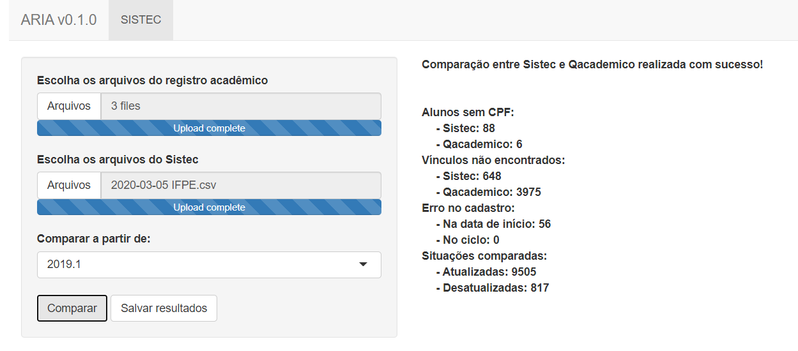

sistec: Tools to Analyze Sistec Datasets
================

[](https://travis-ci.org/r-ifpe/sistec)
[](https://cran.r-project.org/package=sistec)

The [Sistec](https://sistec.mec.gov.br/) is the Brazilian system for
diploma registration and validation on technical and superior courses.
The sistec package provides tools for Brazilian institutions to update
the student’s registration and make data analysis about their situation,
retention and drop out.

## Installation

You can install the sistec package from
[CRAN](https://CRAN.r-project.org) as follows:

``` r
install.packages("sistec")
```

To upgrade to the latest version of sistec, run the following command
and restart your r session:

``` r
install.packages("devtools")
devtools::install_github("r-ifpe/sistec")
```

Load the package.

``` r
library(sistec)
```

## Sistec datasets

You can download the Sistec’s student registration using your proper
account on Sistec. The package provides support if your data comes from
[setec](http://portal.mec.gov.br/setec-secretaria-de-educacao-profissional-e-tecnologica)
or [web](https://sistec.mec.gov.br/). Be sure that your data has these
variables:

  - On setec: “Nome Aluno”, “Numero Cpf”, “Co Ciclo Matricula”,
    “Situacao Matricula”, “No Curso”, “Dt Data Inicio” and “Unidade
    Ensino”.

  - On web: “NO\_ALUNO”, “NU\_CPF”, “CO\_CICLO\_MATRICULA”,
    “NO\_STATUS\_MATRICULA”, “NO\_CICLO\_MATRICULA”,
    “DT\_DATA\_INICIO” and “CO\_UNIDADE\_ENSINO”.

Tip: To take every student for your institution/campus using web, search
by student name and use " ".

## Qacademico datasets

To download the student’s data, go to your proper account on Qacademico
and follow:

  - “Relatorio de Alunos” –\> “Listagem de Alunos” (choose year and
    period)
  - Click on “visualizar”
  - Using f10 shortcut and save in .csv format.
  - Rename the including year and period (example2020\_1.csv)

Be sure that your data has the variables: “Matricula”, “Nome”, “Situacao
Matricula”, “Curso”, “Cpf”, “Instituicao”, “Per. Letivo Inicial” and
“Cota”.

## Sigaa datasets

To download the student’s data, go to your proper account on Sigaa and
follow:

  - Access the panel “Consultas” inside Sigaa module.
  - Generate the report “Consulta geral discentes”.
  - Select the check box “Trazer informações em forma de relatório” e
    “Gerar csv”.
  - Select the filter “Campus” and other filter you desire.
  - Selecionar o filtro “campus” ou outros filtros desejados.
  - Click on “Buscar” and download the file.

Be sure that your data has the variables: “Matricula”, “Nome”,
“Status,”Curso" and “CPF”.

## Read files

Load the sistec package and pass the folder path to `read_*()`
functions. (**NOTE**: These datasets were generated randomly and do not
represent the reality, it is just for example
purpose).

``` r
sistec <- read_sistec(system.file("extdata/examples/sistec", package = "sistec"))
qacademico <- read_rfept(system.file("extdata/examples/qacademico", package = "sistec"))
```

## Comparison

Compare the student’s situation using `compare_sistec()`

``` r
comparison <- compare_sistec(sistec, qacademico)
```

## Save results

You can save the comparison in .xlsx format using `write_output()`

``` r
write_output(output_path = "your_folder",
             output_folder_name = "the_name_you_want",
             comparison = comparison)
```

## ARIA web interface

ARIA is the web interface created in this package to ease your work. You
can use all those functions just clicking in a few buttons, run
`aria()`.


