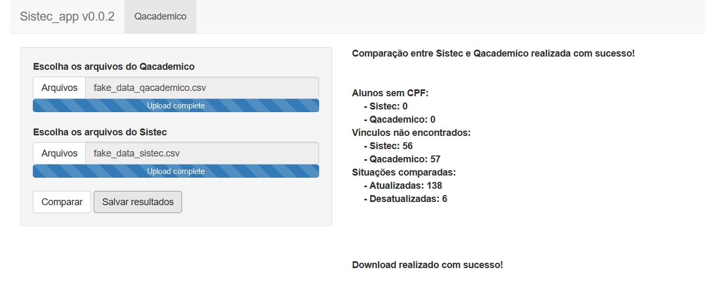

sistec: Tools to Analyze Sistec Datasets
================

[](https://travis-ci.org/r-ifpe/sistec)

The [Sistec](https://sistec.mec.gov.br/) is the Brazilian system for
diploma registration and validation on technical and superior courses.
The sistec package provides tools for Brazilian institutions to update
the student’s registration and make data analysis about their situation,
retention and drop out.

## Installation

To upgrade to the latest version of sistec, run the following command
and restart your r session:

``` r
install.packages("devtools")
devtools::install_github("r-ifpe/sistec")
```

## Sistec datasets

You can download the Sistec’s student registration using your proper
account on Sistec. The package provides support if your data comes from
[setec](http://portal.mec.gov.br/setec-secretaria-de-educacao-profissional-e-tecnologica)
or [web](https://sistec.mec.gov.br/). Be sure that your data has these
variables:

  - On setec: “Nome Aluno”, “Numero Cpf”, “Co Ciclo Matricula”,
    “Situacao Matricula”, “No Curso”, “Dt Data Inicio” and “Unidade
    Ensino”.

  - On web: “NO\_ALUNO”, “NU\_CPF”, “CO\_CICLO\_MATRICULA”,
    “NO\_STATUS\_MATRICULA”, “NO\_CICLO\_MATRICULA”,
    “DT\_DATA\_INICIO” and “CO\_UNIDADE\_ENSINO”.

Tip: To take every student for your institution/campus using web, search
by student name and use " ".

## Qacademico datasets

By now, the sistec package only supports student’s comparison between
Sistec and Qacademico. To download the student’s data, go to your proper
account on Qacademico and follow

  - “Relatorio de Alunos” –\> “Listagem de Alunos” (choose year and
    period)
  - Click on “visualizar”
  - Using f10 shortcut and save in .csv format.
  - Rename the including year and period (example2020\_1.csv)

Be sure that your data has the variables: “Matricula”, “Nome”, “Situacao
Matricula”, “Curso”, “Cpf”, “Instituicao”, “Per. Letivo Inicial”.

## Read files

Load the sistec package and pass the folder path to `read_*()`functions.
(**NOTE**: These datasets were generated randomly and do not represent
the reality, it is just for example purpose).

``` r
library(sistec)

sistec <- read_sistec(system.file("extdata/examples/sistec",
                                  package = "sistec"))

qacademico <- read_qacademico(system.file("extdata/examples/qacademico",
                                          package = "sistec"))
```

## Comparison

Compare the student’s situation using `sistec::compare_sistec()`

``` r
comparison <- compare_sistec(sistec, qacademico)
```

## Save results

You can save the comparison in .xlsx format using
`sistec::write_output()`

``` r
write_output(output_path = "your_folder",
             output_folder_name = "the_name_you_want",
             comparison = comparison)
```

## Web interface

You also can use all those tools using the web interface, run
`sistec::sistec_app()`.


